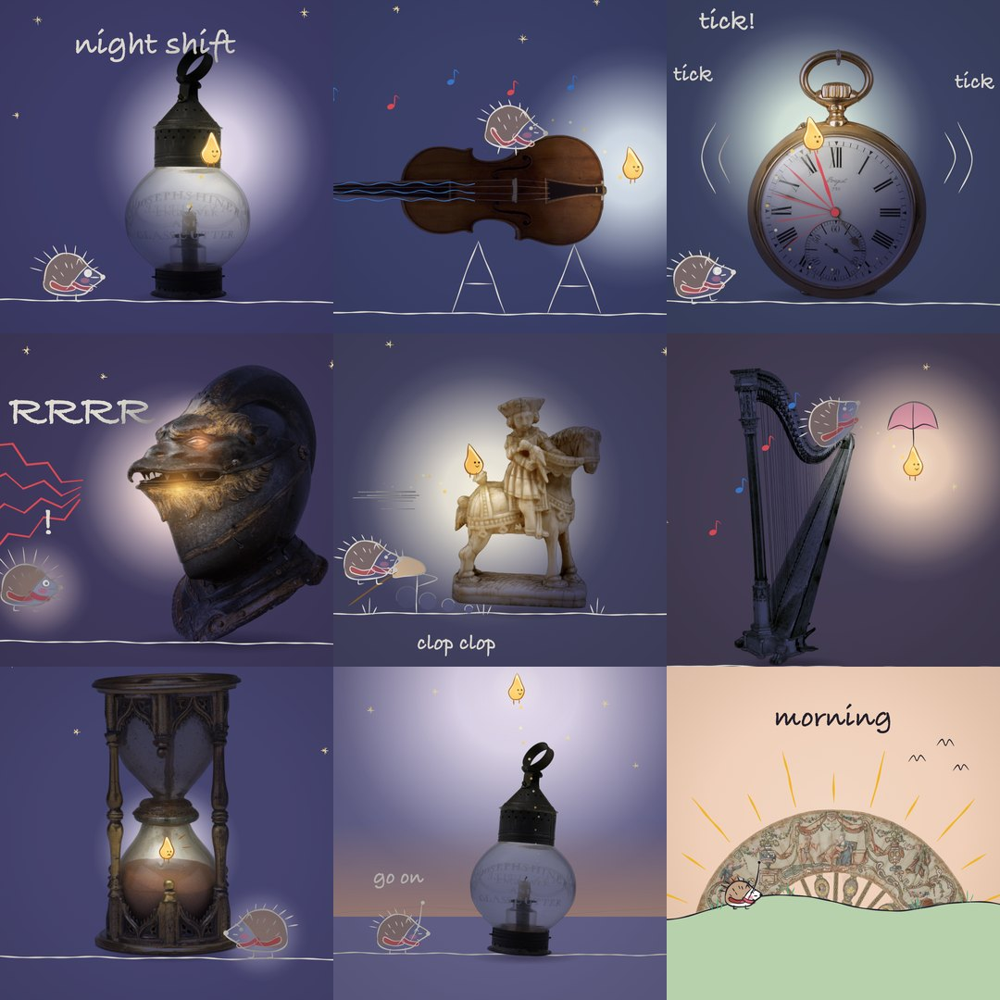
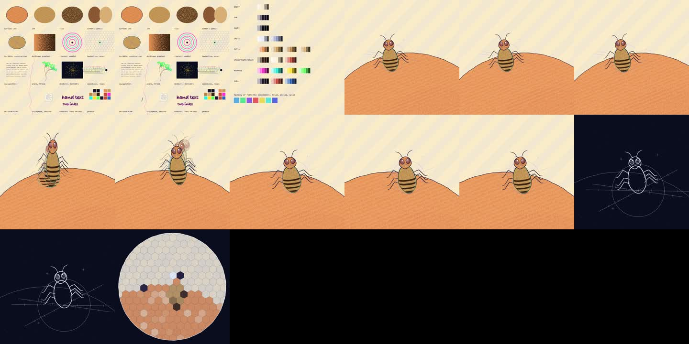
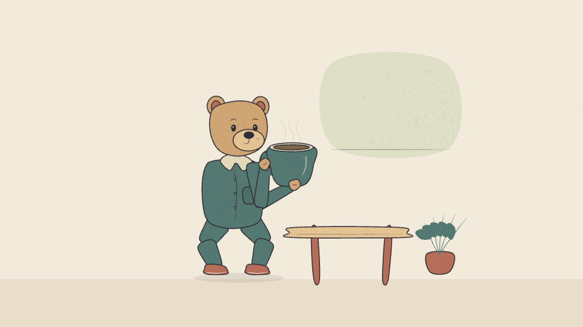

# hand-drawn-canvas-animation

An agent skill for films drawn and animated in JavaScript on Canvas 2D.
An HTML player loads local drawing and timeline modules. Headless Chrome
renders the frames, ffmpeg encodes the video, and Web Audio can synthesize
music and effects from the same timeline. Blender, WebGL and a video-generation
model are not required.

The complete [Becoming example](examples/becoming-phoenix/README.md) is a
60-second film with five drawing styles, sand animation and a pop-up book.
Its printed landscape becomes a physical page; a compact paper bird unfolds
into a phoenix. The storm moves through several forest layers and affects the
bird's balance. Each technique advances the same story.


The editable [film source](examples/becoming-phoenix/phoenix.html) includes the
original synthesized score. Read [mixed-media.md](references/mixed-media.md)
for continuity between techniques, and use the smaller studies below to learn
individual drawing and motion mechanisms.

The default for characters is a sequence of whole-pose drawings with visible
strokes, authored breakdowns and intentional holds. The new pencil/ink study
uses nine body keys, assisted geometric inbetweens and a replacement blink.


Start with [sketchbook-bird.html](examples/sketchbook-bird.html) and
[the redrawn-animation guide](references/redrawn-animation.md). The older
examples below cover other materials and mechanisms.

The first four looks come from four films by Kevin Ngo: [the life of a fruit fly](https://x.com/kevin_t_ngo/status/2099858454043349342),
a [riso flipbook](https://x.com/kevin_t_ngo/status/2099477219877978289),
a [paper boat](https://x.com/kevin_t_ngo/status/2099308402887520495) and
his model's [personal website](https://x.com/kevin_t_ngo/status/2093500169723814093).
I measured each one frame by frame and rebuilt what they share and what they
do differently as one core with a palette system and four finishes.

The fifth look came later, from his [doodles on photos](https://x.com/kevin_t_ngo/status/2100601972902842517):
a photo of a real object, cut out and set on pastel paper, and brush-pen
drawings that turn it into something else. The example below uses five
open-access photos from The Met: a teapot from 1755, a pocket watch, a
Stradivari violin from 1693, a lantern and a teacup.


The same look at night, from a 31 second chase. The light is a character, and
wherever it goes the paper and the object show their real colours. Lines are
ink inside the pool of light and chalk outside it.



| look | palette | finish | what it is |
|---|---|---|---|
| ink | `paperInk` | pressure contours and form hatching | confident brush gestures, deliberate black masses and white gaps |
| riso | `risoPop` | separate ink coverage and halftone | overprint colours, restrained registration offset and paper showing through |
| screen | `screenSea` | opaque ink; optional halftone | strong flat shapes, cut stencil edges and sparse coverage wear |
| pencil | `pencilMinimal` | thin graphite | open contours, lighter construction marks and pressure-shaped hatching |
| doodle | `doodlePastel` | brush pen, watercolour wash, white gouache | a cut-out photo on a pastel sheet, drawings that draw themselves on, behind and inside the object, night with lamps |

Three engines go further than drawing on a flat frame. Found motion traces real
movement into strokes the film redraws, sand animation runs a bed of sand that a
hand works in one unbroken take, and paper in space stands the drawn sheets up as
a pop-up book. They load next to the core and can be used together.

| engine | file | what changes |
|---|---|---|
| found motion | [`assets/roto.js`](assets/roto.js), [`scripts/roto.py`](scripts/roto.py) | the poses come from a real motion study or the user's own video, traced stroke by stroke |
| sand | [`assets/sand.js`](assets/sand.js) | the frame is a bed of sand on backlit glass, poured, wiped, swept and blown; nothing is redrawn |
| paper in space | [`assets/paper3d.js`](assets/paper3d.js) | the sheets stand in a 3D room: pages turn, cut-outs rise, light and shadow |


Any of them re-colours in one line, with a preset, a preset with overrides, a
hue-shifted derivative, or a duotone. Films default to 24 fps. Characters can mix ones, twos and held drawings by
action; camera, particles and light have separate timing.
Drawing construction, spacing and exposure must work together.

Draw the changing silhouette and overlaps of each key pose before applying a
material. Lines can taper, break, retrace selected edges and describe volume
with short hatching. Keep the marks still for the duration of an exposure.
Uniform wobble, perpetual boil and a paper overlay cannot supply the drawing.

Rigs, springs, camera helpers and the bug template remain available for the
shots that need them. They are construction tools and mechanism examples;
whole-drawing animation is the starting point for the requested sketch look.
Inspect the actual encoded action before judging its drawing or timing.


## Files

| path | what it is |
|---|---|
| [`SKILL.md`](SKILL.md) | the procedure the agent follows, the rules, the review checklist |
| [`assets/core.js`](assets/core.js) | the core: colour maths and palettes, four finishes, marks, lattices, motifs, reveals, photos and doodles, camera, timeline, score plumbing, player |
| [`assets/cels.js`](assets/cels.js) | whole stroke drawings, finite exposure sheets, compatible inbetweens, graphite and ink brushes |
| [`examples/sketchbook-bird.html`](examples/sketchbook-bird.html) | primary redrawn pencil/ink study, 6 s, nine whole-body keys, no joint rig |
| [`examples/becoming-phoenix/`](examples/becoming-phoenix/) | complete 60 s film, moving storm, linked materials, gradual paper unfolding and original score |
| [`references/mixed-media.md`](references/mixed-media.md) | connect different styles and techniques through one action and story |
| [`references/redrawn-animation.md`](references/redrawn-animation.md) | drawing-first workflow, mark language, cel API and review criteria |
| [`assets/film-template.html`](assets/film-template.html) | legacy rig starter: brief, palette, a puppet from blobs, a hop with anticipation, arc, squash, smear and settle under a handheld camera, a blueprint interlude, score, 24 fps |
| [`examples/four-looks.html`](examples/four-looks.html) | a paper boat through riso, screen, pencil and ink, 13.5 s |
| [`examples/fly-style.html`](examples/fly-style.html) | a 9.5 s ink film: peach, ink blot, dividing egg, flight through a kitchen, compound-eye view |
| [`examples/held-once.html`](examples/held-once.html) | a 22 s doodle film on five museum photos, with its photos in `held-once-photos.js` |
| [`examples/night-shift.html`](examples/night-shift.html) | a 31 s chase at night on nine museum photos: moving light, runners on the real edge of a violin, a camera that follows and whips on the cuts |
| [`examples/workshop.html`](examples/workshop.html) | a point-and-click screen that drives the film engine on the held-once photos: alpha-exact hit-testing on the cutouts, hover, event sound on `note()` and `noiseBurst()`, iris and blot transitions |
| [`examples/gallop.html`](examples/gallop.html) | 34.5 s of found motion. Muybridge's 1878 question, the airborne frame, a disc that spins up until the horse runs |
| [`examples/one-seed.html`](examples/one-seed.html) | 40 s of sand at full range: a camera over the table from one grain to a forest, wind, rain, snow, seasons in the lamp |
| [`examples/one-year.html`](examples/one-year.html) | 39.5 s of sand in one take, a tree through its year |
| [`examples/moon-book.html`](examples/moon-book.html) | a 29 s pop-up book with a paper moon that lights up |
| [`examples/paper-horse.html`](examples/paper-horse.html) | 47 s with all three engines. A book whose page is a light table, and a horse that runs out of it |
| [`scripts/render.mjs`](scripts/render.mjs) | a 24-frame sheet in seconds, spot frames, format and resolution flags, mp4 with the score muxed in, contact sheet, from one headless Chrome |
| [`scripts/photo.mjs`](scripts/photo.mjs) | cuts a found photo out of its background, registers it as a data URL, writes a check sheet with a coordinate grid |
| [`references/style.md`](references/style.md) | art direction and quality gates for all five looks |
| [`references/palettes.md`](references/palettes.md) | the palette schema, presets, deriving, tints and shades, finishes and riso plates |
| [`references/scenes.md`](references/scenes.md) | thirty-nine scene recipes, timing, score motifs |
| [`references/motion.md`](references/motion.md) | keys, exposure, spacing, contacts and normal-speed motion review |
| [`references/architecture.md`](references/architecture.md) | file layout, API index, how to build a character, riso plates, pitfalls |
| [`references/found-motion.md`](references/found-motion.md) | sources of real movement, how to trace a clip and draw with one |
| [`references/sand.md`](references/sand.md) | the rules of the sand table, its gestures, camera, wind and score |
| [`references/paper3d.md`](references/paper3d.md) | sheets in 3D, the pop-up book, shading and shadows |
| [`references/doodle.md`](references/doodle.md) | the doodle look: finding the idea in an object, sourcing and cutting photos, anchors, pens, drawings inside the object, night |
| [`references/brief-template.md`](references/brief-template.md) | the brief the agent fills before writing code |
| [`references/reference-films.md`](references/reference-films.md) | measurements and shot lists of the five films |

## Install

User scope:

```bash
cp -r hand-drawn-canvas-animation ~/.agents/skills/
```

If your agent reads skills from another directory, copy the folder there.
Project scope is `.agents/skills/` inside the repo you work in.

Tracing a clip for found motion needs Python with numpy, scipy, scikit-image
and pillow (`pip install numpy scipy scikit-image pillow`); nothing else does.

Rendering needs Node 22.12 or newer, Google Chrome or Chromium, and ffmpeg.
`puppeteer-core` drives the Chrome you already have and downloads nothing.
The doodle look cuts photos best with `rembg` on PATH
(`pip install "rembg[cpu,cli]"`); without it `photo.mjs` falls back to a
colour flood that only holds on flat backgrounds.

## Using it

Ask for a film and give it a subject and a look:

> 20 seconds, the life of a request inside a GPU server, riso look, a seed
> dot as the anchor.

The agent draws the key poses and breakdowns, establishes an exposure sheet,
and finishes the hardest action before expanding the film. It checks visible
strokes, volume, contacts and timing in stills, consecutive strips and the
encoded film. Style sheets and palette boards are optional working aids.
Render the drawing example directly:

```bash
cd hand-drawn-canvas-animation
cd scripts && npm i --no-audit --no-fund && cd ..
node scripts/render.mjs examples/sketchbook-bird.html --look pencil --grid 24 --out /tmp/bird
node scripts/render.mjs examples/sketchbook-bird.html --look pencil --width 1920 --out /tmp/bird
node scripts/render.mjs examples/becoming-phoenix/phoenix.html --width 1920 --out /tmp/becoming
```

The preview writes a contact sheet; the full render writes
`/tmp/bird/sketchbook-bird.mp4` and its frames. For an original film, copy
`core.js`, `studio.js`, `cels.js`, `render.mjs` and `package.json` into its own
folder. Author an HTML film using the example's runtime wiring, with local
script paths. Add `materials.js` when the shot needs its fills or print helpers.

Scenes use logical units with the short side fixed at 1080. Output width is
configurable; inspect fine marks after scaling and encoding. Alternate aspect
ratios still need composition review. Render cost depends on drawing count,
resolution and materials. The pencil/ink study has no music, so timing can be
judged without a score.
If the film has a score, the full render also writes `out/my-film-score.wav`
and `out/my-film-final.mp4` with sound. Open the HTML file directly in a
browser to scrub and play with sound.

For a doodle film, cut the photos first:

```bash
cp hand-drawn-canvas-animation/scripts/photo.mjs my-film/
node photo.mjs teapot.jpg --name teapot --credit "Teapot, ca. 1755. The Met, CC0"
```

That writes the cutout into `photos.js` and a check sheet with a grid into
`out/photo-teapot.jpg`. The agent reads spout, rim and handle positions off
that grid and hangs every drawing on them, so the drawings follow when the
object tips or bobs.

Photo credits for the examples: every object is from The Metropolitan Museum
of Art, Open Access (CC0). Titles and links sit next to each photo in
[`examples/held-once-photos.js`](examples/held-once-photos.js) and
[`examples/night-shift-photos.js`](examples/night-shift-photos.js).
The phoenix film's sources and example branding are documented in
[`examples/becoming-phoenix/SOURCES.md`](examples/becoming-phoenix/SOURCES.md).


## Production drawing and motion

The primary [cels.js](assets/cels.js) workflow is documented in
[redrawn-animation.md](references/redrawn-animation.md). Optional
[studio.js](assets/studio.js) and
[materials.js](assets/materials.js) also provide exposure tracks, drawing substitutions,
two-bone contact IK, arc-length paths, stable pressure strokes, form-following
hatching, graphite marks, opaque screen ink and pigment washes.



[One careful cup](examples/weight-study.html) is a seven-second performance study
with five material variants. It demonstrates contact, weight transfer and mixed
exposure. Its assembled character is a secondary mechanism example, not the
aesthetic target for redrawn sketch animation. No procedural helper establishes
feature-film quality on its own. See [studio.md](references/studio.md) for usage and limits.

```bash
node scripts/render.mjs examples/weight-study.html --look pencil --out /tmp/pencil
node scripts/render.mjs examples/weight-study.html --strip 48,12 --out /tmp/strip
node scripts/verify.mjs
```

Film format is respected unless overridden. Full exports use isolated frame
sets; scaled riso plates handle coverage and transparency consistently. Sand
has normalised wipe redistribution and checkpoint seeking; book pages can curl
with matching shadows. These remain controlled Canvas approximations.

Compatibility: omitted fps now means 24, while scene i remains the legacy 12 Hz
index. Specify fps:12 to retain an older film's cadence. For a 24 fps Remotion
composition and 24 fps film, pass frame directly. Choose and review each shot's
exposure rather than treating all character motion on ones as a defect.
