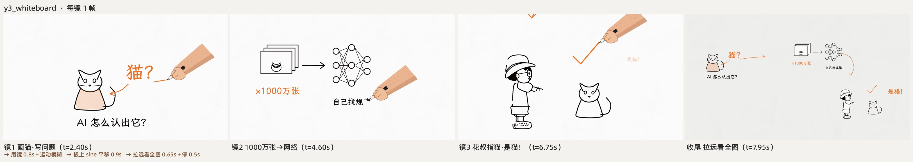
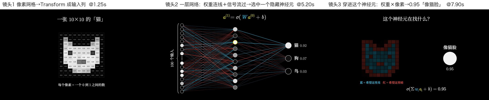

<div align="center">


# huashu-art-motion · 艺术动画

让你的coding agent，把艺术风格写成会动的画。

35种艺术风格 · 9种解说语法 · 8种参数化片段 · 口播整片参考代码

```sh
npx skills add alchaincyf/huashu-art-motion
```

[看动画](#动画样片) · [看风格](#看效果) · [开始使用](#里面有什么) · [下载完整样片](https://github.com/alchaincyf/huashu-art-motion/releases/latest)

</div>

## 动画样片

画里真的会动。下面三段来自同一支穿越短片，场景用代码画，角色用生成帧合成。


日本桥上的一次水漂。

<table><tr>
<td width="50%"><br/>古埃及 · 圣甲虫</td>
<td width="50%"><br/>8-bit · 顶出金币</td>
</tr></table>

## 看效果


35段样片各取一帧：同一位少女、同一只橘白猫、同一张桌子，从公元前 40000 年的岩洞一路穿到 2026 年。每一段都在动：梵高的星空在转，马赛克的颜色从石块上流过去，水墨晕染把画面带进下一个时代。

👉 [下载全风格样片（MP4）](https://github.com/alchaincyf/huashu-art-motion/releases/latest)

长卷穿越片：一个人从左走到右，跨过边界的那一刻，世界和他自己的画风一起换（下图是收进仓库的 3 段示范：埃及壁画 → 莫奈《日本桥》→ 8-bit）：


8种解说语法各有一支可运行示范片（下图每镜取一帧）。此外还有第9种「讲解员式财经科普」，提供语法卡和需自备角色的整片代码快照。白板适合跟着口播画关系，Vox适合图形与信息拼贴：

| | |
|---|---|
|  Kurzgesagt：扁平无描边、尺度穿行 |  Vox：剪报、红线、荧光笔 |
|  白板：笔尖揭开线稿 |  3Blue1Brown：一个对象形变成下一个 |
|  Storytime：反应特写、笑点停顿 |  动态文字：主词砸进来 |
|  发布会：光斑底、毛玻璃卡、大数字 |  财经图表：先轴、后数据、只标一件事 |

---

## 能做什么

| 你说 | 它做 |
|---|---|
| 「复刻这个动画」「拆一下这段」 | 先跑拆解脚本量出转场、节拍网格、每段运动热图，再按机制用代码复刻 |
| 「做个梵高／莫奈／包豪斯那种的动画」 | 先设计一帧，再让它动起来；35张风格配方卡当起点 |
| 「用我的口播做一段艺术动画」 | 镜头表 → 定风格 → 世界画布加镜头 → 输出一条画面轨 |
| 「做一个人穿过一幅幅名画的片子」 | 长卷骨架：每个世界一个段文件，主角一路往右走，跨边界换画风，镜头只进不退 |
| 「做解说视频的动画段」 | 按口播选语法，喂一份 JSON，出一段时长精确到帧的片段（横竖屏、可透明底） |
| 「画面里要有人」 | 人交给生图模型出帧，代码负责合成、换帧和材质 |
| 「配个乐、卡节奏」 | BPM 网格、动机换乐器、结尾音效序列，纯代码合成 |

交付前有一道数字验收：`qa.py` 量稳定、效率、动感、流畅及文字框景线索，再派一个没参与制作的 agent 只看成片挑问题。

---

## 里面有什么

| | 数量 |
|---|---|
| 艺术风格配方卡（参数、母题动作、签名转场、当前短板） | 35张，`references/风格配方/` |
| 对应的场景代码 | 35个，`scripts/engine/scenes/` |
| 解说动画语法卡 | 9份；其中8种附示范片、参数化片段与示例spec |
| 口播整片参考代码 | 混合风格、白板、Vox、讲解员；需自备部分素材，详见目录README |
| 长卷穿越片示范（骨架＋3 段＋角色帧库） | 1 支，`scripts/engine/demos/long_scroll/` |
| 转场 | 艺术风格签名转场与解说转场，包含淡入、硬切和纸面转场 |
| 绘画与动画库（笔刷、渲染器、后期、骨架、镜头、图表、排版……） | 17 个，`scripts/engine/lib/` |
| 方法文档（拆解、机制、一帧先行、纯代码绘制、节奏配乐、角色、长卷……） | 12篇，`references/01`–`12` |

```
huashu-art-motion/
├── SKILL.md                 # 先判断任务，再按表读对应文档
├── references/              # 01–12方法文档、35张风格配方卡、9张语法卡、正面经验
├── assets/                  # 总览图（README 用）
└── scripts/
    ├── engine/              # 可整个复制走的动画工程：引擎、转场、库、场景、示范片、片段
    ├── analyze/breakdown.py # 把参考动画拆成「能写代码的地图」
    ├── qa.py                # 一键验收
    ├── audio/               # 纯代码合成配乐的模板
    └── font_subset.py ...   # 字体子集、绿幕抠图
```

依赖：[uv](https://docs.astral.sh/uv/)、ffmpeg、Playwright Chromium（第一次跑 `uv run --with playwright playwright install chromium`）。试一下：

```sh
cd huashu-art-motion
uv run --with playwright python scripts/engine/render.py --solo 09_postimp --stills 0.3 --out 试渲   # 梵高那一段的一帧
uv run --with playwright python scripts/engine/render.py --spec scripts/engine/examples/t3_finance_chart.json --out 财经图表.mp4
```

---

## 背后的故事

2026 年 10 月初，我在 X 上看到 Tak（[@cherry_mx_reds](https://x.com/cherry_mx_reds/status/2106095190285144331)）的一支 15 秒动画：一位少女和一只猫穿过 40000 年艺术史，每个时代只有一秒左右，但画里的东西都在动。

我让 Claude 复刻它。第一版是「一张张画之间做转场」，被我否了：原片每个时代可能就一秒，但画里的元素完全是流动的。于是改成先拆解（量转场、拟合节拍网格、看每段哪里在动），再用代码一层层把画画出来、让它动起来。

做的过程中我跟它说：「我们不只是为了复刻，我需要你积累经验。」所以这个 skill 里记的不只是代码，还有哪些做法被证明有效（`references/07-正面经验.md`）、每种风格的坑和短板。之后又派了 4 组只读 skill 的 agent 去做它没见过的 20 种风格，把它们各自造的轮子收成统一的库；再加上 8 种 YouTube 解说动画语法，接进了我自己的口播视频管线。最后用同一套东西做了《花叔穿越名画》：23种画风、2分08秒，我从洞穴一路走到 2026，骨架和其中 3 段也收进来了。

---

## 致谢

- **Tak（[@cherry_mx_reds](https://x.com/cherry_mx_reds)）** 的《Art History Speedrun》是这个 skill 的起点。16 个艺术时代的场景构图和「少女＋猫穿越」的设定沿用了原片的思路，画面全部用代码重新画，配乐脚本里是原创示例乐谱（只保留拆解方法，不保留对原曲的转录）；仓库里不含原片的帧、截图或音频文件。想看原作请去他的 X。
- 解说语法卡里拆解过的频道和资料（Kurzgesagt、Vox、3Blue1Brown、RSA Animate、TheOdd1sOut 等）都在各张卡的「一手参考」里给了链接，仓库只记测量出来的参数，不含他们的画面。
- 字体都是 SIL OFL 1.1 开源字体，清单和版权见 `scripts/engine/lib/fonts/LICENSES.md`。

---

## 关于作者

| | |
|:---|:---|
| 🌐 官网 | [bookai.top](https://bookai.top) · [huasheng.ai](https://www.huasheng.ai) |
| 𝕏 Twitter | [@AlchainHust](https://x.com/AlchainHust) |
| 📺 B站 | [花叔v](https://space.bilibili.com/14097567) |
| ▶️ YouTube | [@Alchain](https://www.youtube.com/@Alchain) |
| 📕 小红书 | [花叔](https://www.xiaohongshu.com/user/profile/5abc6f17e8ac2b109179dfdf) |
| 💬 公众号 | 微信搜「花叔」 |

## 许可证

代码和文档：MIT。随便用，随便改，随便造。

例外：笔顺衍生数据`reference_films/spacex/spacex_wb/assets/strokes.js`沿用Arphic Public License（原文随文件附带）；`scripts/engine/lib/fonts/` 里的字体沿用各自的 OFL 许可；花叔的卡通形象与角色帧（`scripts/engine/demos/_shared/hero/`、`scripts/engine/demos/long_scroll/frames/`、`assets/角色/`）以及总览图、示范视频中包含的同一形象，只用于本 skill 的示范，不随 MIT 授权用于其他用途。

---

<div align="center">

**[女娲](https://github.com/alchaincyf/nuwa-skill)** 造 Skill。**[达尔文](https://github.com/alchaincyf/darwin-skill)** 让 Skill 进化。**艺术动画** 让画动起来。

MIT License © [花叔 Huashu](https://github.com/alchaincyf)

</div>

---

<div align="center">
<sub>作者的其他项目 · also by 花叔</sub>

[](https://github.com/alchaincyf/fanbox)

</div>

---

## English

**huashu-art-motion** is an agent skill for making animation with code, where the paintings actually move. It ships 35 art-style recipes (cave painting, Egyptian murals, Van Gogh, Klimt, Bauhaus, Kirby comics, 8-bit, vaporwave, Shinkai and more), each with a working Canvas scene, a style "renderer" and a signature transition; 8 explainer-video grammars (Kurzgesagt, Vox, whiteboard, storytime, kinetic type, 3Blue1Brown, keynote UI, finance charts) with demo films and parameterized clips you drive with a JSON spec, frame-accurate and in landscape, portrait or alpha; a long-scroll skeleton where a character walks left to right through one painting after another (3 sample worlds included); plus a breakdown script that maps a reference animation into cuts, beat grid and motion heatmaps, and a QA script that measures stability, cost per frame, motion and smoothness.

It started as a code-only recreation of Tak's ([@cherry_mx_reds](https://x.com/cherry_mx_reds/status/2106095190285144331)) 15-second *Art History Speedrun*. The scene layouts and the girl-and-cat premise follow his original; every frame here is redrawn in code, and no frames, screenshots or audio from the original are included.

Install: `npx skills add alchaincyf/huashu-art-motion`. Requires uv, ffmpeg and Playwright Chromium. The skill content is in Chinese. The ninth grammar, presenter-led explainers, ships as a reference implementation and requires your own character assets. Full-narration examples are code snapshots, not ready-to-render projects. Code and docs are MIT; the bundled stroke medians retain the Arphic Public License; bundled fonts keep their SIL OFL licenses; the Huashu character artwork, including its appearance in overview images and demo videos, is for demo use only.
