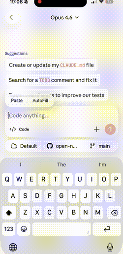

<div align="center">

# OpenNote

**Capture fragments today. Make better decisions tomorrow.**

*Your thoughts, compounded.*

[Quick Start](#quick-start) · [How It Works](#how-it-works) · [Examples](#examples) · [Why Plain Files?](#why-plain-files)

</div>

---

<table>
<tr>
<td width="250">

</td>
<td>

You're on the bus and have an idea. You open Claude on your phone and say:

```
Asymmetry is the whole game when the future is uncertain.
```

**Hit send. That's it.** Claude handles the rest — organizes it into a markdown file, commits, and pushes to your Git repo. Timestamped, categorized, searchable, and yours forever.

</td>
</tr>
</table>

## Highlights

- **Capture from anywhere** — Phone, desktop, or CLI. Drop a thought, a screenshot, a URL, or meeting notes. No app to install.
- **AI organizes for you** — Just dump content in. AI structures it into clean markdown files, auto-categorized by topic and date.
- **You own your data** — Plain markdown + Git. No vendor lock-in. No cloud database. `grep` works.

---

> ### The real power: AI that evolves you
>
> Most note apps are just storage. OpenNote is different — every note you capture becomes part of AI's understanding of *you*.
>
> Over weeks and months, your info bank accumulates fragments: a product idea on Monday, a meeting note on Wednesday, a quote that resonated on Friday, a frustration you vented about on Sunday. Individually, they're just notes. But AI can read across all of them — and **surface the hidden threads you'd never notice yourself.**
>
> Ask it to brainstorm, and it doesn't start from zero. It draws on everything you've ever captured — your interests, your patterns of thinking, your recurring frustrations, your half-formed ideas — and weaves them into insights that feel like they came from your subconscious. *Because in a way, they did.*

---

## Quick Start

> Expects [Claude Code](https://docs.anthropic.com/en/docs/claude-code) and [GitHub CLI (`gh`)](https://cli.github.com/) installed.

```bash
gh repo fork ryannli/open-note --clone
cd open-note
./setup.sh
```

Start capturing:

```bash
claude "Asymmetry is the whole game when the future is uncertain."
```

Or open Claude on your phone and just start talking.

## How It Works

```
You (phone or desktop)          ← the only thing you do
  → Claude Code                 ← everything below is automatic
    → structured markdown file
      → Git commit & push
        → GitHub (synced)
```

Send a message. That's it. No manual filing, no tagging, no folder management.

## Examples

| You send | AI creates |
|----------|------------|
| `"Asymmetry is the whole game when the future is uncertain."` | `notes/2026-03-09_interface-design.md` — timestamped note with your thought, auto-categorized |
| *sends a photo of a whiteboard* | `notes/2026-03-09_whiteboard-notes.md` — extracts all text from the image into a searchable note |
| `https://example.com/interesting-article` | `notes/2026-03-09_interesting-article.md` — fetches, summarizes, and saves with context |
| `"what patterns do you see in my notes from the past week?"` | `explorations/2026-03-09_weekly-patterns.md` — finds recurring themes across your notes |


## Directory Structure

```
open-note/
├── CLAUDE.md          # AI instructions — customize how notes are organized
├── notes/             # One file per topic, organized by date
│   ├── 2026-03-06_product-ideas.md
│   ├── 2026-03-07_thoughts-after-meeting-alex.md
│   └── ...
└── explorations/      # You + AI thinking together through your notes
    └── 2026-03-10_weekly-themes.md
```

- **`notes/`** — Where everything lands. Each note has YAML frontmatter (date, time, summary) for quick scanning.
- **`explorations/`** — You and AI think together — pick a lens, and explore your notes to find patterns and ideas you wouldn't see alone.
- **`CLAUDE.md`** — The brain of the system. Edit this to change how AI captures and organizes your content.

## Why Plain Files?

Plain files aren't just a technical choice — they're what makes the "evolve" part possible. AI can read your full history of thinking, across any time range, any topic. That's what lets it connect a frustration from January to an idea from March to a conversation from last week — and show you something you never noticed.

| | OpenNote | Typical note apps |
|---|---|---|
| **Format** | Plain markdown | Proprietary database |
| **AI access** | Full — AI reads everything, connects anything | Limited to what the app exposes |
| **History** | Full Git history | Limited or none |
| **Search** | `grep`, GitHub, or ask AI | Built-in only |
| **Portability** | Works with any editor | Locked to one app |
| **Privacy** | Your repo, your rules | Their servers |

## Customization

OpenNote is configured through `CLAUDE.md` — the instruction file that tells Claude how to organize your notes. Edit it to match your workflow. It's just a markdown file.

## License

[MIT](LICENSE)
